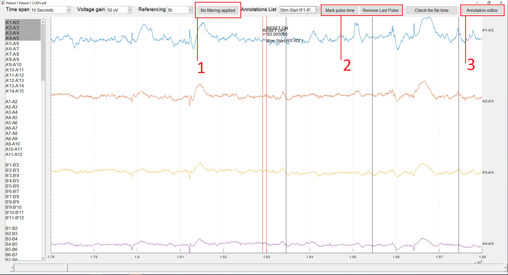

# CCEP Toolbox Python

A Python port of David Prime’s **Cortico-cortical Evoked Potentials (CCEP)**
Toolbox for analysing Single Pulse Electrical Stimulation (SPES) in SEEG data.
The goal is the complete MATLAB workflow: electrode localization, recording and
annotation review, RMS/ERP processing, connectivity analysis, and results exploration.

**Development status:** implementation is underway. This is not yet a validated
replacement for the MATLAB toolbox. See the [work-package status](docs/port/status.md)
for implemented functionality and missing acceptance evidence.

The original toolbox is for clinical research only; no clinical decisions should
be made based on its results.

## Workflow

1. Organise recordings, electrode maps, MRI and CT files by participant.
2. Align images and acquire electrode locations; review anatomy and tissue labels.
3. Load an EDF, select channels and unipolar/bipolar references, and review or edit
   annotations and stimulation pulse times.
4. Process pulse trains into RMS ratios, ERP waveforms, and ranked responses.
5. Explore individual results or aggregate a repository into anatomical
   connectivity reports. Preserve MATLAB interfaces and add CSV exports.



See the [concise illustrated workflow guide](docs/legacy-workflows.md),
[historical manual](docs/original-manual.md), and
[port roadmap](Initial_port_roadmap_and_workpackages.md).
The image above shows the original MATLAB application. See the
[Python GUI verification record](docs/port/gui-verification.md) for implementation screenshots.

## Install from source

Python 3.11–3.14 is the target; platform/dependency validation is tracked explicitly.
From this repository, using [uv](https://docs.astral.sh/uv/):

```sh
uv sync --python 3.11 --extra gui
```

Or install into a Python virtual environment with pip:

```sh
python -m pip install -e ".[gui]"
```

With uv, launch using `uv run --no-sync ccep-gui` and view commands with
`uv run --no-sync ccep --help`. In an activated pip environment, use `ccep-gui`
and `ccep` directly.
A generated end-to-end example is in [the CLI guide](docs/cli.md).

The imaging candidate includes registration, verified image/contact transforms and
an explicit six-tissue normalization workflow. Read the
[SPM12 replacement trade study](docs/research/spm12_python_trade_study.md) and
[ANTsPy–SimpleITK synthetic comparisons](docs/research/registration_benchmarks.md)
for the backend choice, measured results and remaining scientific validation.
The [ANTs implementation record](docs/research/ants_icbm152_implementation.md)
covers the earlier ext55 experiments, named recipes and legacy imaging adapters.
The preferred template is now [McGill symmetric ICBM152 2009a](docs/port/icbm152_2009a.md),
with GM/WM/CSF priors and a lightweight voxel-count regression check.
SimpleITK is limited to optional release comparisons; ordinary CI uses ANTsPy.

The library installation is `python -m pip install -e .`. Python 3.14 core/GUI
installation was tested with pip-style dependency resolution; the current full
uv lock includes ANTsPy's older SciPy constraint and is for Python 3.11 development. The GUI extra includes NIfTI review; the optional `imaging`
extra supplies ANTsPy. ANTsPy contains native code; availability
must be checked for your Python version and operating system. A successful core
installation does not establish full imaging support. No MATLAB runtime is
required by Python. No PyPI release has been published by this porting work.

## Contribute

```sh
uv sync --python 3.11 --extra gui --extra imaging --group gui-tests
uv run --no-sync pre-commit install
uv run --no-sync python tools/check.py
```

Use typed Python, Ruff for lint/imports, Black for formatting, and Pyright for
types. Tests accompany each feature. MATLAB parity and scientific corrections
are separate changes: capture the original behavior first, then document and
verify a corrective delta. See [CONTRIBUTING.md](CONTRIBUTING.md).

## Credit and methods

Author: David Prime PhD. Original copyright 2020 QIMR Berghofer Medical Research
Institute; GPL v3 or later. Matthew Woolfe contributed the EDF/SEEG functionality.
See [NOTICE.md](NOTICE.md) and [LICENSE](LICENSE).

- Prime et al. (2020), *Comparing Connectivity Metrics in Cortico-Cortical Evoked
  Potentials Using Synthetic Cortical Response Patterns*, Journal of Neuroscience
  Methods 334:108559. <https://doi.org/10.1016/j.jneumeth.2019.108559>
- Prime (2019), *Evaluating, Improving and Applying Cortico-Cortical Evoked
  Potentials in Stereoelectroencephalography*, Griffith University thesis.
  <https://research-repository.griffith.edu.au/handle/10072/391058>
- Prime et al. (2018), *Considerations in Performing and Analyzing the Responses
  of Cortico-Cortical Evoked Potentials in Stereo-EEG*, Epilepsia 59:16–26.
  <https://doi.org/10.1111/epi.13939>
