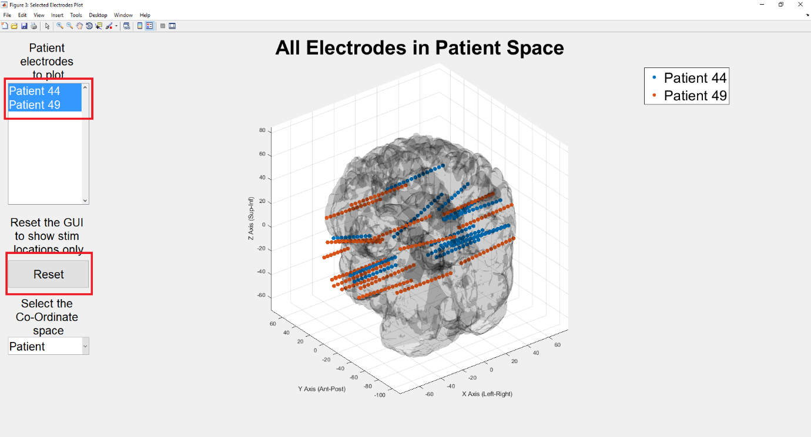
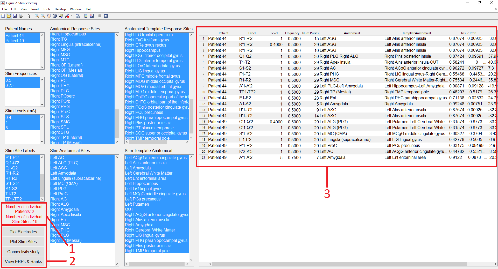
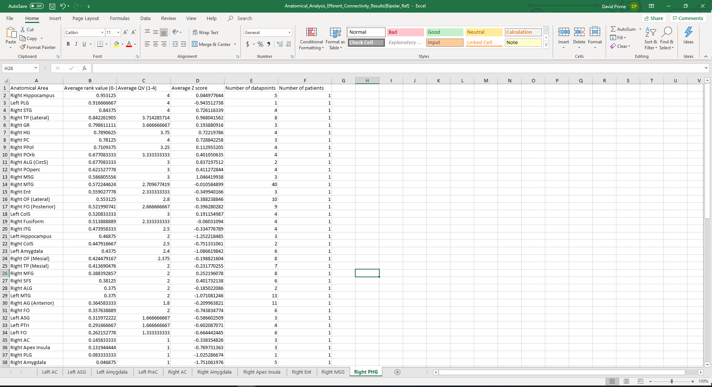
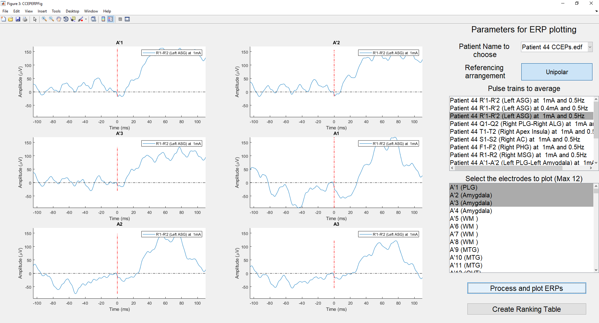
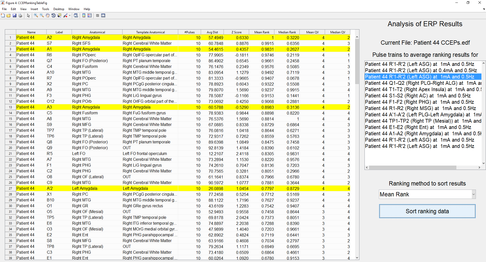

# CCEP workflow guide

This concise adaptation preserves the original manual’s scientific workflows.
All six images below are historical MATLAB screenshots. Consult
[implementation status](port/status.md) before using the Python port.

## Prepare data and stimulation settings

Keep MRI, CT and EDF files together by participant, with consistent identifiers
across filenames, the anatomical spreadsheet and electrode files. Preserve the
original anatomical map and a standardised `Formatted` sheet. Check contact names
and anatomy before import: identity errors propagate to localization and analysis.
The Python port uses explicit paths instead of MATLAB’s search path.

The original stimulation tool accepts electrode geometry, contact dimensions,
current and pulse width, and compares the resulting parameters with the bundled
study table. It plots current against pulse width and exposes study details.
The manual distinguishes the Gordon et al. (1990) prolonged 50 Hz stimulation
conditions from SPES; reproducing these calculations does not establish new
safety recommendations.

## Align images and localize electrodes

Start with structural T1 MRI, electrode-bearing CT (or post-implantation MRI),
and the anatomical map. Convert DICOM to NIfTI before the original pipeline.
Align the origins near the anterior commissure and review rotations. The MATLAB
viewer uses neurological display (left is left). Geometry conventions must remain
explicit in Python; SPM processing is being replaced by ANTsPy.

The legacy acquisition workflow loads the aligned CT, imaging-information MAT,
original MRI and SPM deformation field. For each electrode choose the actual
contact count (legacy controls: 3–20, default 15), acquire its most mesial start
and most lateral end, then interpolate contact positions. Reacquiring requires
both endpoints. Review all contacts in patient space before converting to MNI
space and assigning atlas/tissue information. Contacts outside the brain are
identified from the map and excluded at recording import.

Review patient and MNI coordinates, anatomy labels and tissue probabilities.
The repository electrode viewer lets researchers select participants, switch
coordinate space and reset to selected stimulation sites. Old SPM deformation
files and new ANTs transforms require separate, explicit compatibility handling.

## Review EDF recordings and annotations

Select a participant and EDF with its associated electrode/anatomical information.
The viewer has a channel list on the left, time-span and voltage-gain controls,
unipolar/adjacent bipolar referencing, a time slider and annotation navigation.
Changing the reference changes channel labels. Selecting an annotation centres
its time in the displayed window.

Toggle filtered/raw data; distinguish annotation markers (red) from stimulation
pulses (black). Automatic pulses come from the configured trigger channel.
Manual pulse marking is also available; “remove last pulse” removes the last
manual pulse, not an automatic one. Open the annotation editor to add/change
annotations and save them together with manually acquired pulse times. Verify
that saved changes are loaded before processing.

## Process and aggregate results

After reviewing images, electrodes and annotations, process the EDF into a
legacy `EDFFileName RMS Values.mat` result. The toolbox computes frequency-specific
responses and baselines, RMS/standard-deviation ratios and ERP/rank information.
Detailed behavior comes from the frozen source and captured outputs, not these
brief instructions.

Add selected processed files to the CCEP repository. The legacy interface adds
files individually and does not offer removal; rebuilding the repository was its
removal workflow. The Python port must characterize persistence and duplicate
handling before claiming compatibility.

Filter by participant, stimulation frequency/current/site and response/stimulation
anatomy. Selections update the results table and unique participant/site counts.
From this selection, inspect electrodes and stimulation locations, start an
anatomical connectivity study, or open ERP and rank results.

Connectivity analyses exclude configured bad anatomical labels, including white
matter and outside-brain labels where specified. The report sorts anatomical
results by patient-normalised rank and contains separate sheets for anatomical
sites. Preserve counts, labels and aggregation semantics alongside numerical values.

## Inspect ERPs and ranks

Choose a recording, reference montage, one or more pulse trains, and up to twelve
channels. Plot the corresponding ERP waveforms with time and amplitude units.

Open the ranking table for the selected pulse trains. Displayed ERP channels are
highlighted. Changing the pulse-train/channel selection and re-sorting must update
the rank results consistently.

For the complete original descriptions, see the [historical manual](original-manual.md).
Installation advice, filenames and timing estimates there describe the MATLAB version.
