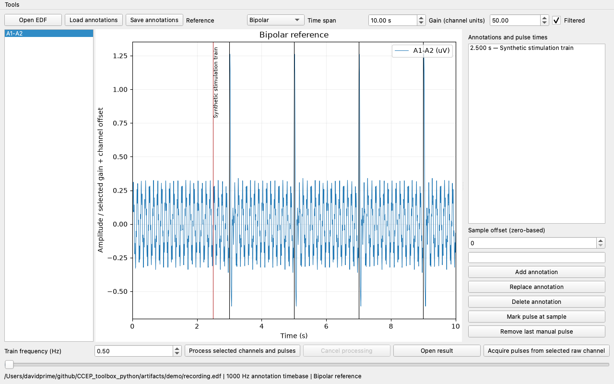
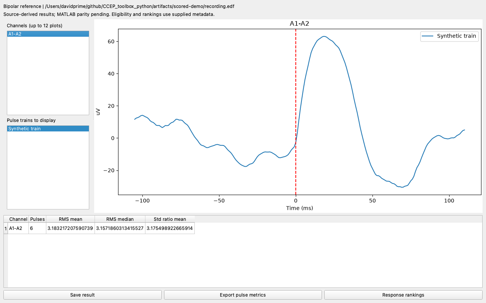
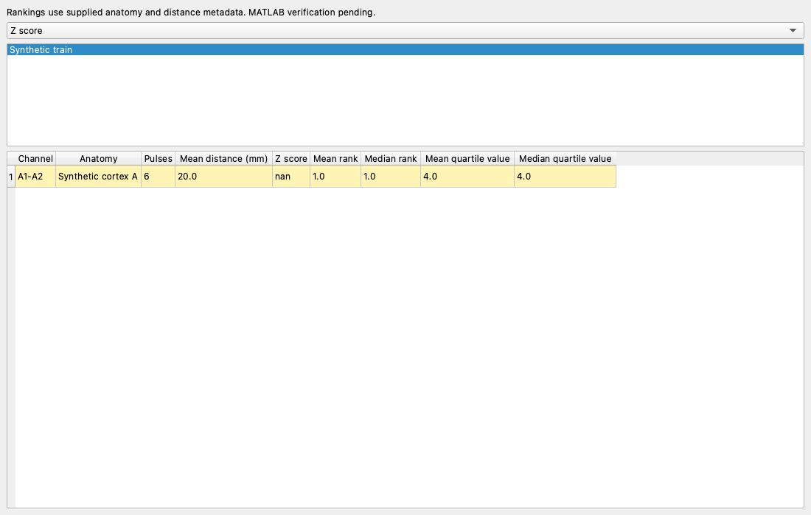
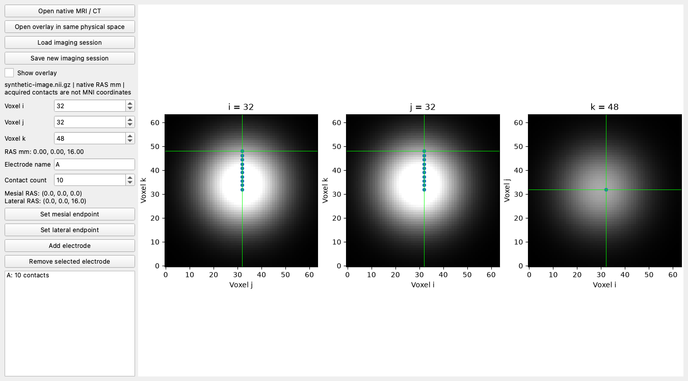

# GUI verification record

The Python desktop application uses PySide6/Qt and Matplotlib. EDF/annotation
handling and processing are shared with the headless library and CLI. The left
channel selector, reference controls, plots and annotation workflow remain the
core interaction model; the layout is intentionally flexible.

The viewer loads EDF and annotation sidecars, selects unipolar/bipolar channels,
changes time span/gain/scroll/filtering, edits annotations, saves/reopens them,
and acquires or undoes pulse selections. Processing snapshots the selected inputs
and runs in a cancellable worker. Filtered display currently caches entire selected
channels; large-recording responsiveness still needs measurement.

Saved results retain pulse and channel identities, array values and effective
settings. The result viewer selects trains/channels, plots mean ERPs, and exports
tables. Explicit scoring metadata and baseline windows enable response rankings.
The ranking table averages selected per-train ranks using the legacy rule;
clicking a row selects its ERP channel. Fictional demo anatomy exercises controls
and is not scientific validation.

The Tools menu also opens historical stimulation geometry/study comparisons and
native image review. Image review displays orthogonal voxel planes, converts the
cursor through the voxel-to-RAS affine, acquires mesial/lateral endpoints, places
3–20 contacts, and saves a checksummed JSON session. Overlays are resampled in
existing physical space; this display does not itself register two images.

All screenshots were captured with Qt offscreen on macOS/Python 3.11 and checked
visually for legible controls, plots and units. They demonstrate implementation,
not equivalence to live MATLAB behavior.

## Executed interaction evidence

- `test_gui.py`: Qt selections/clicks, bipolar plotted arrays, annotation MAT
  save/reopen, automatic/manual pulse distinction, processing snapshot and ERP data.
- `test_rankings_gui.py`: selected-train aggregation, order changes, linked channel
  selection and empty selection.
- `test_safety_gui.py`: contact geometry controls and historical study table input.
- `test_imaging_gui.py`: slice/cursor changes, a reflected/anisotropic affine,
  endpoint interpolation, overlay visibility, saved session integrity, contact CSV
  export and rejection of unknown spatial units.
- `test_canvas.py`: reproduces and prevents deletion of a plot’s owning Qt window
  during rendering; the original unprotected canvas fails the regression case.
- Independent reader/science/CLI tests check calibration, sample origins, array
  values and saved artifacts; screenshots do not substitute for those assertions.

Still required: matched MATLAB task walkthroughs and author acceptance; full
repository/anatomical workflows; complete imaging registration/segmentation,
reorientation and legacy sessions; study-detail/plot parity; GUI configuration for
all scientific parameters; long-running performance/cancellation; Windows/Linux
GUI execution. The current tests and images do not certify these obligations.
