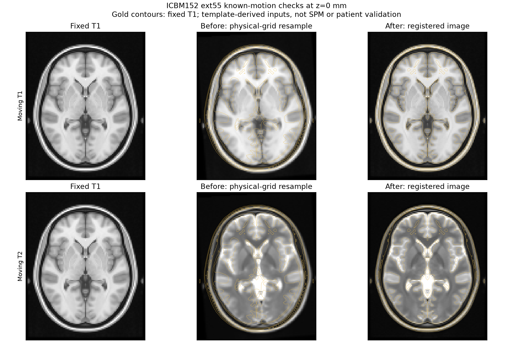

# ANTs implementation and McGill template checks

11 September 2026. Production imaging uses ANTsPy; SimpleITK is absent from runtime
code and ordinary CI. The existing comparison script and optional dependency group
are retained solely for manually dispatched release comparisons in
`.github/workflows/release-imaging-comparison.yml`. No fallback is installed.

## Implemented recommendations

| Recommendation | Implementation and evidence |
|---|---|
| Explicit task recipes | `task_settings`: rigid Mattes MI for CT→MRI; affine initialization plus CC SyN (radius 4) for T1→template. These are candidate parameters, not accepted SPM equivalents. Earlier generic recipes remain explicitly selectable. |
| Repeatable registration | Fresh worker with one ITK thread from process startup; API/CLI array equality tested after prior one/four-thread native operations. Caller RNG/environment preserved. |
| Registration masks | Separate fixed/moving binary masks, applied at all stages and recorded by checksum. CT intensity values are not passed through N4. |
| Separate estimation masks | Normalization accepts a bias-estimation mask separately from the six-tissue segmentation mask, plus optional fixed/moving registration masks. Omitted bias mask preserves the earlier shared-mask behavior. |
| Template identity | Local McGill ZIP importer checks the exact asset set, grids, finite data, binary masks and integer atlas IDs; retains COPYING and hashes. Load verifies artifacts before use. |
| Native tissue/atlas sampling | Pure functions preserve sample multiplicity, float32 sample/mean staging and distinct exact versus legacy closest-absolute atlas lookup. CLI consumes explicit captured sample points. |
| Legacy shape generation | Default cylinder retains 36 points, duplicate seams and ignored-radius behavior; displaced cube and stretched rectangle remain source-derived. Random clouds require captured offsets rather than pretending NumPy reproduces MATLAB RNG. |
| Contact normalization | Source-derived MarsBaR row-norm sphere rasterization plus bundle-based warping and threshold centroid. CLI reports direct transformed points separately. Original Euclidean sphere remains a named alternative. |
| SPM fields | Explicit absolute-source-RAS pull reader supports `(x,y,z,1,3)` and `(x,y,z,3)`; nearest label/linear intensity resampling. Does not infer field convention from filenames. |
| Reorientation | Caller-supplied proper rigid RAS matrix updates headers in a new file without interpolating voxel data. Preserves exact sform and disables unrepresentable qform for shear. |
| MATLAB acquisition sessions | Imports `ElectrodeArray` endpoints/count/name only when every saved `PosMM` agrees with interpolation. Retains the original MAT identity and all original metadata in that untouched file; rejects curved/modified contacts requiring another adapter. |

An ANTs automatic header-reorientation candidate smooths the source at 12 mm
FWHM, estimates rigid alignment to an explicit template and updates the original
header. It does not reproduce SPM affreg optimization. GUI processing controls,
DICOM/Analyze adapters and complete historical session/output round-tripping remain
separate compatibility work. Source-derived adapters still require MATLAB captures,
including SPM display-text precision, before they can be accepted as parity.

## Supplied template

The supplied archive is **ICBM152 ext55 symmetric 2020**, not a generic MNI atlas
and not “MNI251”. McGill describes extending the ICBM152 cohort template by 55 mm
inferiorly. [McGill dataset description](https://nist.mni.mcgill.ca/icbm-152-extended-nonlinear-atlases-2020/)

Archive SHA256:
`28244a77baf21f6e8d5e3907cf8ed90a86aaacc6150809cb76f03957b4fce505`.
This identifies the user-supplied archive; no upstream authenticated checksum was
provided. Installed locally at ignored `artifacts/templates/icbm152-ext55-2020`.

The six NIfTIs share shape **193 × 239 × 263**, 1 mm spacing, RAS voxel-to-world
translation **(-96, -132, -148) mm**, qform code 0 and sform code 1. Files contain
T1, T2, PD, a binary mask, binary outline and integer CerebrA IDs (0–102). The
archive includes **neither a six-tissue TPM set nor an atlas ID/name table**.
Anatomical regions must not be relabeled as tissue priors. Tiny negative values
occur in the averaged intensity images; the importer preserves them. N4 retains
its separate positive-in-estimation-mask requirement.

Original assets remain local, outside the package. The illustrative figure below
is derived from these templates; its [McGill copyright/license](../assets/mcgill/COPYING)
is retained. The license permits use, copying, modification and distribution with
its copyright notice. No external assets are fetched implicitly by production code.

## ANTs-only template experiment

Reproduce after installing the archive:

```sh
ccep --json image-template-install ~/Downloads/icbm152_ext55_model_sym_2020_nifti.zip artifacts/templates/icbm152-ext55-2020
python tools/benchmark_ants_template.py --template artifacts/templates/icbm152-ext55-2020/template.json --output artifacts/template-study/NEW_RUN
python tools/render_template_study.py artifacts/template-study/NEW_RUN artifacts/template-study/NEW_RUN/overlays.png
python tools/check_template_atlas.py artifacts/template-study/NEW_RUN artifacts/template-study/NEW_ATLAS_CHECK
```

ANTsPy 0.6.3, macOS arm64, Python 3.11.15, one ITK thread, seed 1729. Images are
resampled once to 2 mm with ANTs; mask/atlas use nearest interpolation. Known motion
is a 4° RAS z rotation plus translation (3, -2, 1) mm, applied to the moving header.
Twenty mask-contained points are selected before fitting and withheld from the
optimizer. Ground truth is the analytic rigid matrix. The T1 case runs affine
plus CC SyN; the T2 case runs rigid Mattes MI. Explicit study schedules are affine
(300,150,75,20), nonlinear (20,10,0), not the longer production candidate schedules.

| Case | Mean landmark error (mm) | Maximum (mm) | Maximum inverse round-trip error (mm) | Elapsed (s) |
|---|---:|---:|---:|---:|
| T1→T1, affine + CC SyN | 0.0323 | 0.2942 | 0.000398 | 13.17 |
| T2→T1, rigid Mattes MI | 0.0596 | 0.1045 | 0.0000207 | 1.54 |

Results and transforms are retained under ignored `artifacts/template-study/ants-v1`.
`results.json` SHA256 is
`52a368baf86fd65a412d8e84a561d52e63e07466a32b80d8833869b177efc4dd`.
Timing covers registration and point application, excluding template preparation.
No accuracy tolerance was selected after seeing these values. T2 is not a CT
surrogate, the templates are already anatomically aligned averages, and known
header motion does not model intersubject deformations. The T1 nonlinear stage
can introduce small local shifts even when ground truth is rigid. These are
engineering checks, not patient validation or matched SPM comparisons.



The CerebrA inverse label-transport check used the fitted T1 bundle and
`genericLabel` interpolation onto the moving grid. It recovered the known-motion
label array exactly across 146,316 foreground-union voxels; no new IDs appeared.
That result is expected for sufficiently small residual motion in this constructed
case. It does not test anatomical label correctness or intersubject registration.
The script above retains the output, hashes, mismatch count and per-region macro
Dice summary in a separate new folder.

## Remaining evidence

A six-class normalization run on this archive requires a separately identified
compatible TPM set; no such maps were fabricated. Matched native MRI/CT/SPM
outputs, atlas lookup tables, captured random/contact sample coordinates and
predeclared scientific tolerances remain required. Full ANTsPy/Python 3.14 support
remains unresolved. The completed synthetic and template checks do not remove
these first-release requirements.

## Reproducibility correction

The single-thread setting must precede native ITK initialization. Running the
registration API after native image operations in an existing process exposed
output differences despite the earlier adapter setting the environment around
`ants.registration`. A two-process test with prior one/four-thread initialization
failed with a maximum intensity difference of 0.00327 on the synthetic fixture.
The same test passes with the new registration worker, without relaxing equality.
The existing API-versus-CLI test also passes without an external thread setting.
This corrects a Python runtime adapter defect; it does not change the scientific
recipe or claim cross-platform bitwise reproducibility.
[ANTs environment controls](https://github.com/ANTsX/ANTsPy/wiki/Important-environment-variables),
[ANTs configuration implementation](https://antspy.readthedocs.io/en/stable/_modules/ants/config.html).
